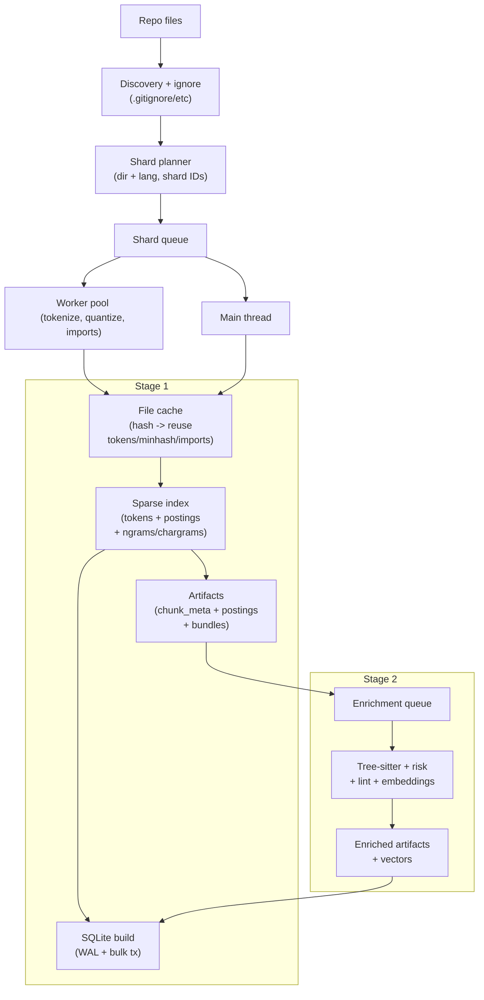
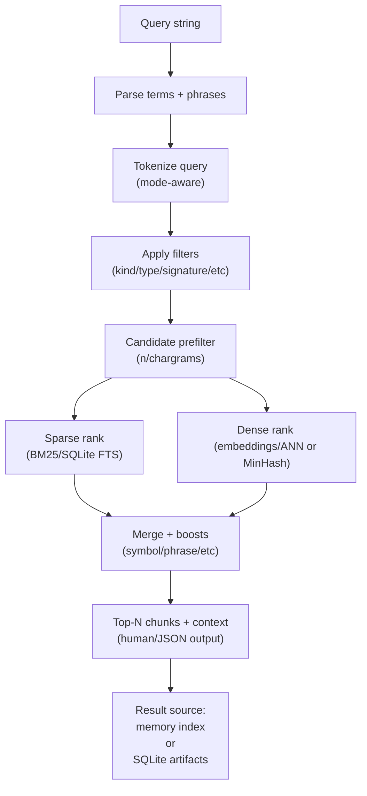

# PairOfCleats

<p align=center></img></p>


**Local-first hybrid code search for humans and coding agents.**  
Build an offline index of a repo, then retrieve the most relevant *chunks* using **BM25 + fuzzy matching + embeddings + metadata filters**.

> **(“Paraclete”):** “PairOfCleats” is a phonetic nod to **Paraclete**—a word meaning *helper/advocate*.
>
> The idea: give your agent (or you) a helper that can sprint through a large codebase with better traction than plain grep.

---

## What this is

PairOfCleats builds a **hybrid semantic index** for a repository (**code + configs + docs**, and optionally **triage records**) and exposes:

- a CLI (`pairofcleats search`, `pairofcleats index build`)
- a code-map generator (`pairofcleats report map`) (see [docs/code-maps.md](docs/code-maps.md))
- an HTTP API server (`pairofcleats service api`)
- an MCP server for agent/tool integration (`pairofcleats service mcp`)

It’s optimized for agent workflows:
- **artifacts are stored outside the repo by default** (cache-backed)
- indexing is language-aware (AST / tree-sitter / heuristics)
- search is fast, filterable, and can use SQLite + ANN when repos get big

---

## Why it exists

Large repos make “just read the whole tree” impractical.

- **Grep** is fast but literal.
- **Pure embeddings** can be fuzzy and harder to constrain.
- Agents need **structured context** (functions/classes/sections), not giant file dumps.

PairOfCleats combines the strengths:

- **Chunk-aware indexing** → results are immediately usable snippets
- **Lexical + fuzzy + semantic retrieval** → better recall without losing precision
- **Rich metadata** → filters like type/signature/reads-writes/calls/churn/risk tags
- **Scale options** → memory artifacts for small repos; SQLite + ANN for large ones

---

## Requirements

- **Node.js 18+**
- Optional (recommended for best Python chunk metadata): **Python 3** (`indexing.pythonAst.*`)
- Optional (recommended for large repos): **SQLite backend** (via `better-sqlite3`)
- Optional (recommended for fastest semantic search): **sqlite-vec** extension for ANN

---

## Quick start
- `pairofcleats setup`
  - Guided prompts for install, dictionaries, models, extensions, tooling, and indexes.
  - Add `--non-interactive` for CI or automated runs.
  - Add `--profile lite|balanced|full` to select a profile.
  - Add `--with-sqlite` to build SQLite indexes.
  - Add `--incremental` to reuse per-file cache bundles.
- `pairofcleats bootstrap` (fast, no prompts)
  - Add `--with-sqlite` to build SQLite indexes.
  - Add `--incremental` to reuse per-file cache bundles.
- `pairofcleats index watch` (FS events by default; add `--watch-poll` to enable polling)
- `pairofcleats service api` (local HTTP JSON API for status/search)
- `pairofcleats service indexer` (multi-repo sync + queue; see [docs/service-mode.md](docs/service-mode.md))
- Cache is outside the repo by default; set `cache.root` in `.pairofcleats.json` to override.
- CLI commands auto-detect repo roots; use `--repo <path>` to override.
- Local CLI entrypoint: `node bin/pairofcleats.js <command>`.
- `npm run <script>` wrappers remain available for CI/automation.
- Core library API: [docs/core-api.md](docs/core-api.md)

### Install
```bash
npm install
```

### Guided setup (recommended)
```bash
pairofcleats setup
```

### Bootstrap (no prompts)
```bash
pairofcleats bootstrap
```

### Build index
```bash
pairofcleats index build
# Add --incremental to reuse per-file cache bundles
# Add --no-sqlite to skip SQLite builds
```

### Search
```bash
pairofcleats search -- "how do we validate JWT tokens?"
pairofcleats search -- "UserRepository findByEmail" --mode code
pairofcleats search -- "rate limit exceeded" --mode prose
```

---

## Query syntax (core)

- `"exact phrase"` boosts phrase matches
- `-term` excludes a token
- `-"phrase"` excludes a phrase

Modes:
- `--mode code` (code-focused)
- `--mode prose` (docs/readmes/comments)
- `--mode extracted-prose` (comment-prose only; requires extracted-prose index)
- `--mode both` (default in many workflows)

Use `--explain` (or `--why`) to see score breakdowns.

---

## Profiles (configuration presets)

PairOfCleats is highly configurable. In current form, there isn’t a single `--profile` flag — a “profile” is just a **small set of `.pairofcleats.json` overrides**.

The table below highlights **real config keys** and the most impactful differences between three practical presets.

> Notes:
> - “Full” is closest to the **default behavior** (many features default to enabled unless explicitly set to `false`).
> - “Lite” is for speed/minimal dependencies.
> - “Balanced” is a strong day-to-day default: hybrid retrieval, but avoids the most expensive analysis.

### Profile differences (actual config keys)

| Capability | Config key(s) | Lite | Balanced | Full | Impact |
|---|---|---:|---:|---:|---|
| Build SQLite DBs | `sqlite.use` | `false` | `true` | `true` | Disables SQLite build step during `build-index` when `false`. |
| Default ANN (semantic) | `search.annDefault` | `false` | `true` | `true` | Controls whether semantic rerank/ANN is enabled by default (CLI can override with `--ann` / `--no-ann`). |
| Phrase n-grams | `indexing.postings.enablePhraseNgrams` | `false` | `true` | `true` | Improves phrase matching; increases index size/build time somewhat. |
| Chargrams (fuzzy) | `indexing.postings.enableChargrams` | `false` | `true` | `true` | Helps typos/partials/paths/identifiers; can increase index size noticeably. |
| AST dataflow summary | `indexing.astDataflow` | `false` | `false` | `true` | Enables reads/writes/mutates/alias-like metadata; increases build cost. |
| Control-flow summary | `indexing.controlFlow` | `false` | `false` | `true` | Enables branches/loops/returns metadata; increases build cost. |
| Risk signals | `indexing.riskAnalysis` | `false` | `false` | `true` | Enables risk tagging (sources/sinks/flows). |
| Cross-file risk correlation | `indexing.riskAnalysisCrossFile` | `false` | `false` | `true` | Heavier; correlates risk through call chains across files. |
| Type inference | `indexing.typeInference` | `false` | `false` | `true` | Opt-in; adds inferred types to metadata. |
| Cross-file type inference | `indexing.typeInferenceCrossFile` | `false` | `false` | `true` | Heavier + more experimental than intra-file. |
| Git blame/churn | `indexing.gitBlame` | `false` | `true` | `true` | Enables blame-derived metadata; adds IO/CPU during index. |
| Lint metadata | `indexing.lint` | `false` | `false` | `true` | JS-focused extraction; increases build time. |
| Complexity metadata | `indexing.complexity` | `false` | `false` | `true` | JS-focused extraction; increases build time. |
| Python AST worker | `indexing.pythonAst.enabled` | `false` | `true` | `true` | Avoids Python dependency in Lite; when enabled, uses Python for richer chunk metadata. |

### Example: Lite preset (`.pairofcleats.json` overrides)

```json
{
  "sqlite": { "use": false },
  "search": { "annDefault": false },
  "indexing": {
    "postings": { "enablePhraseNgrams": false, "enableChargrams": false },
    "astDataflow": false,
    "controlFlow": false,
    "riskAnalysis": false,
    "riskAnalysisCrossFile": false,
    "typeInference": false,
    "typeInferenceCrossFile": false,
    "gitBlame": false,
    "lint": false,
    "complexity": false,
    "pythonAst": { "enabled": false }
  }
}
```

If you also want **no model downloads**, run indexing/search with:
```bash
export PAIROFCLEATS_EMBEDDINGS=stub
```
(or pass `--stub-embeddings` to `build-index`).

### Example: Balanced preset (`.pairofcleats.json` overrides)

```json
{
  "sqlite": { "use": true },
  "search": { "annDefault": true, "sqliteAutoChunkThreshold": 5000 },
  "indexing": {
    "postings": {
      "enablePhraseNgrams": true,
      "phraseMinN": 2,
      "phraseMaxN": 4,
      "enableChargrams": true,
      "chargramMinN": 3,
      "chargramMaxN": 5
    },
    "astDataflow": false,
    "controlFlow": false,
    "riskAnalysis": false,
    "riskAnalysisCrossFile": false,
    "gitBlame": true,
    "lint": false,
    "complexity": false
  }
}
```

### Example: Full preset (`.pairofcleats.json` overrides)

```json
{
  "sqlite": { "use": true },
  "search": { "annDefault": true },
  "indexing": {
    "postings": {
      "enablePhraseNgrams": true,
      "phraseMinN": 2,
      "phraseMaxN": 4,
      "enableChargrams": true,
      "chargramMinN": 3,
      "chargramMaxN": 5
    },
    "astDataflow": true,
    "controlFlow": true,
    "riskAnalysis": true,
    "riskAnalysisCrossFile": true,
    "typeInference": true,
    "typeInferenceCrossFile": true,
    "gitBlame": true,
    "lint": true,
    "complexity": true
  }
}
```

---

## Backends (memory vs SQLite)

PairOfCleats can query indexes through different backends:

- **memory**: file-backed JSON artifacts loaded into memory
- **sqlite**: SQLite tables used as the backend (same general scoring model)
- **sqlite-fts**: FTS5 scoring mode (fast, but scoring differs)

For large repos, SQLite is usually the best experience.

Build SQLite indexes:
```bash
pairofcleats sqlite build
```
Search with SQLite:
```bash
pairofcleats search -- "query" --backend sqlite
```

---

## Where artifacts live (cache)

By default, caches and indexes live **outside the repo**:

- cache root: OS-specific (or `PAIROFCLEATS_HOME` / `PAIROFCLEATS_CACHE_ROOT`)
- per-repo artifacts: `<cache>/repos/<repoId>/builds/<buildId>/index-code`, `index-prose`, etc.
- current pointer: `<cache>/repos/<repoId>/builds/current.json` (active build root)

Override cache location via `.pairofcleats.json`:
```json
{ "cache": { "root": "/absolute/path/to/cache" } }
```

---

## Mental model diagrams

### Indexing pipeline (build)



### Search pipeline (query)



---

## Learn more (repo docs)

- Search pipeline: [`docs/search.md`](docs/search.md)
- Setup & bootstrap: [`docs/setup.md`](docs/setup.md)
- Config schema: [`docs/config-schema.json`](docs/config-schema.json)
- SQLite schema: [`docs/sqlite-index-schema.md`](docs/sqlite-index-schema.md)
- SQLite ANN extension: [`docs/sqlite-ann-extension.md`](docs/sqlite-ann-extension.md)
- API server: [`docs/api-server.md`](docs/api-server.md)
- MCP server: [`docs/mcp-server.md`](docs/mcp-server.md)
- Triage records: [`docs/triage-records.md`](docs/triage-records.md)
- Structural search: [`docs/structural-search.md`](docs/structural-search.md)

---

## Status

Active development. See `NEW_ROADMAP.md` for current execution status.

---

## License

See the repository license file.
