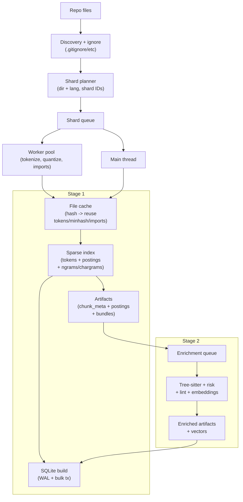
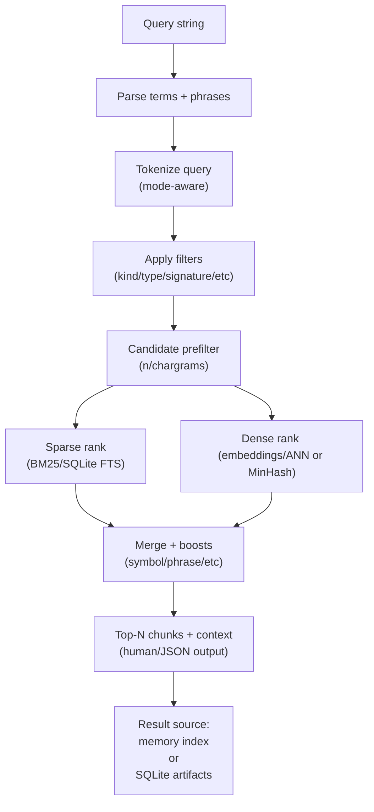

# PairOfCleats

<p align=center></img></p>


**Local-first hybrid code search for humans and coding agents.**  
Build an offline index of a repo, then retrieve the most relevant *chunks* using **BM25 + fuzzy matching + embeddings + metadata filters**.

> **(“Paraclete”):** “PairOfCleats” is a phonetic nod to **Paraclete**—a word meaning *helper/advocate*.
>
> The idea: give your agent (or you) a helper that can sprint through a large codebase with better traction than plain grep.

---

## What this is

PairOfCleats builds a **hybrid semantic index** for a repository (**code + configs + docs**, and optionally **triage records**) and exposes:

- a CLI (`pairofcleats search`, `pairofcleats index build`)
- an HTTP API server (`pairofcleats service api`)

It’s optimized for agent workflows:
- **artifacts are stored outside the repo by default** (cache-backed)
- indexing is language-aware (AST / tree-sitter / heuristics)
- search is fast, filterable, and can use SQLite + ANN when repos get big

---

## Why it exists

Large repos make “just read the whole tree” impractical.

- **Grep** is fast but literal.
- **Pure embeddings** can be fuzzy and harder to constrain.
- Agents need **structured context** (functions/classes/sections), not giant file dumps.

PairOfCleats combines the strengths:

- **Chunk-aware indexing** → results are immediately usable snippets
- **Lexical + fuzzy + semantic retrieval** → better recall without losing precision
- **Rich metadata** → filters like type/signature/reads-writes/calls/churn/risk tags
- **Scale options** → memory artifacts for small repos; SQLite + ANN for large ones; `auto` picks the best available backend based on index size + installed deps

---

## Requirements

- **Node.js 18+**
- Optional (recommended for best Python chunk metadata): **Python 3** (`indexing.pythonAst.*`)
- Optional (recommended for large repos): **SQLite backend** (via `better-sqlite3`)
- Optional (recommended for fastest semantic search): **sqlite-vec** extension for ANN
- Optional (document extraction): **PDF/DOCX support** via `pdfjs-dist` + `mammoth` (`indexing.documentExtraction.enabled` or `PAIROFCLEATS_DOC_EXTRACT=on`)
- Optional performance backends (auto-selected when available): **LMDB**, **LanceDB**, SQLite ANN extension. Set explicit config to force a backend.

---

## Quick start
- `pairofcleats setup`
  - Guided prompts for install, dictionaries, models, extensions, tooling, and indexes.
- `node tools/setup.js --non-interactive` for CI or automated runs.
- `pairofcleats bootstrap` (fast, no prompts)
- `pairofcleats index watch`
- `pairofcleats service api` (local HTTP JSON API for status/search)
- Cache is outside the repo by default; set `cache.root` in `.pairofcleats.json` to override.
- CLI commands auto-detect repo roots; use `--repo <path>` to override.
- Local CLI entrypoint: `node bin/pairofcleats.js <command>`.
- `npm run <script>` wrappers remain available for CI/automation.
- Core library API: [docs/core-api.md](docs/core-api.md)

### Install
```bash
npm install
```

### Guided setup (recommended)
```bash
pairofcleats setup
```

### Bootstrap (no prompts)
```bash
pairofcleats bootstrap
```

### Build index
```bash
pairofcleats index build
# Add --mode code|prose|both to scope the index
# Add --quality auto|fast|balanced|max to tune AutoPolicy
```

### Search
```bash
pairofcleats search -- "how do we validate JWT tokens?"
pairofcleats search -- "UserRepository findByEmail" --mode code
pairofcleats search -- "rate limit exceeded" --mode prose
```

---

## Query syntax (core)

- `"exact phrase"` boosts phrase matches
- `-term` excludes a token
- `-"phrase"` excludes a phrase

Modes:
- `--mode code` (code-focused)
- `--mode prose` (docs/readmes/comments)
- `--mode extracted-prose` (comment-prose only; requires extracted-prose index)
- `--mode both` (default in many workflows)

Use `--explain` (or `--why`) to see score breakdowns.

---

## Backends (memory, SQLite, LMDB)

PairOfCleats can query indexes through different backends:

- **memory**: file-backed JSON artifacts loaded into memory
- **sqlite**: SQLite tables used as the backend (same general scoring model)
- **lmdb**: LMDB tables used as the backend (build separately)
- **sqlite-fts**: FTS5 scoring mode (fast, but scoring differs)

For large repos, SQLite is usually the best experience.

Build LMDB indexes:
```bash
pairofcleats lmdb build
```
Search with SQLite:
```bash
pairofcleats search -- "query" --backend sqlite
```

---

## Where artifacts live (cache)

By default, caches and indexes live **outside the repo**:

- cache root: OS-specific (override with `cache.root` in `.pairofcleats.json`)
- per-repo artifacts: `<cache>/repos/<repoId>/builds/<buildId>/index-code`, `index-prose`, etc.
- current pointer: `<cache>/repos/<repoId>/builds/current.json` (active build root)

Override cache location via `.pairofcleats.json`:
```json
{ "cache": { "root": "/absolute/path/to/cache" } }
```

---

## Mental model diagrams

### Indexing pipeline (build)



### Search pipeline (query)



---

## Learn more (repo docs)

- Search pipeline: [`docs/search.md`](docs/search.md)
- Setup & bootstrap: [`docs/setup.md`](docs/setup.md)
- Config schema: [`docs/config-schema.json`](docs/config-schema.json)
- SQLite schema: [`docs/sqlite-index-schema.md`](docs/sqlite-index-schema.md)
- SQLite ANN extension: [`docs/sqlite-ann-extension.md`](docs/sqlite-ann-extension.md)
- API server: [`docs/api-server.md`](docs/api-server.md)
- Triage records: [`docs/triage-records.md`](docs/triage-records.md)
- Structural search: [`docs/structural-search.md`](docs/structural-search.md)

---

## Status

Active development. See `NEW_ROADMAP.md` for current execution status.

---

## License

See the repository license file.
