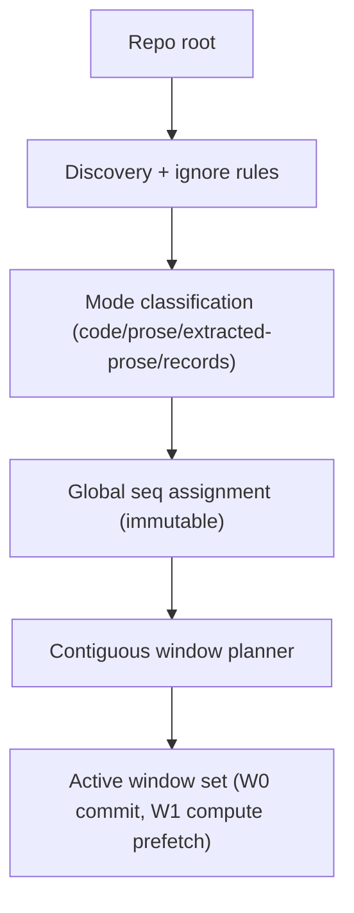
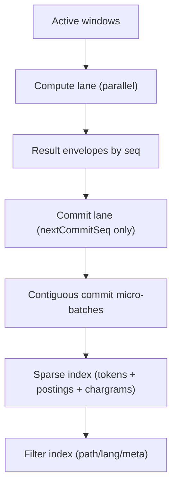

# Architecture diagrams

This document holds detailed system diagrams. The README only keeps a simplified, high-level explainer.
Update these diagrams when the pipeline changes.

## Path handling

See `docs/guides/path-handling.md` for the canonical path policy used across indexing and tooling.

## Indexing (build)

### 0) Runtime + config resolution

References:
- docs/config/contract.md
- docs/config/hard-cut.md
- docs/specs/runtime-envelope.md

### 1) Discovery and Stage1 sequencing

References:
- docs/contracts/indexing.md
- docs/guides/triage-records.md
- docs/specs/stage1-order-contiguous-runtime.md
- docs/specs/stage1-window-planner.md

### 2) Foreground build pipeline

References:
- docs/contracts/indexing.md
- docs/language/import-links.md
- docs/guides/search.md
- docs/specs/stage1-order-contiguous-runtime.md
- docs/specs/stage1-backpressure-controller.md

### 3) Artifacts and SQLite build

References:
- docs/contracts/public-artifact-surface.md
- docs/contracts/sqlite.md
- docs/sqlite/index-schema.md

### 4) Background enrichment

References:
- docs/contracts/indexing.md
- docs/guides/embeddings.md
- docs/sqlite/ann-extension.md

### 5) Build promotion and current pointer

References:
- docs/specs/watch-atomicity.md
- docs/specs/build-state-integrity.md

## Search (query)

### 0) CLI parse and mode resolution

References:
- docs/contracts/search-cli.md
- docs/guides/search.md

### 1) Query parsing and filters

References:
- docs/contracts/search-contract.md
- docs/guides/search.md

### 2) Ranking and fusion

References:
- docs/contracts/retrieval-ranking.md
- docs/guides/search.md
- docs/guides/embeddings.md

### 3) Output and context

References:
- docs/contracts/search-contract.md
- docs/guides/search.md

### 4) Query cache

References:
- docs/guides/query-cache.md

## Backend selection

### Sparse backend choice

References:
- docs/contracts/search-cli.md
- docs/contracts/sqlite.md
- docs/guides/external-backends.md

### ANN backend choice

References:
- docs/contracts/search-cli.md
- docs/sqlite/ann-extension.md
- docs/guides/external-backends.md

